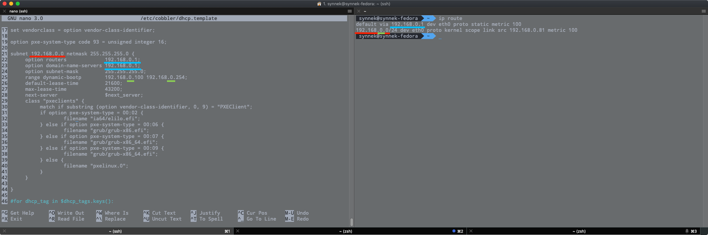

<!–-break-–>

Imagine a situation when you don' t have pendrive or DVD Disk to boot Fedora installer from. You can easily setup PXE Server, and boot your PC from it. I'll show you how to do it in this article.

# Server-side configuration
## Disabling SELinux
Execute ```sudo setenforce 0``` to disable SELinux temporarily.

## Cobbler PXE Server installation
To install Cobbler on Fedora, you have to execute this command: ```sudo dnf install cobbler dnf-plugins-core pykickstart yum-utils```

## Cobbler Configuration
Cobbler configuration is stored in ```/etc/cobbler/settings``` file.

### Changing default encrypted password
Paste the output of ```openssl passwd -1``` to ***line 101*** of config file **(Don' t forget about quote marks)**.

### Configuring address that your server is listening at
Check your local IP Addres by executing ```ip addr```


Enter this IP Address in ***line 272*** and ***line 384*** of config file. **(without /xx)**
### DHCP Configuration
DHCP configuration is stored in ```/etc/cobbler/dhcp.template``` file. \
Use data gathered from ```ip route``` to configure DHCP server. \


After this, in ***line 242*** of ```/etc/cobbler/settings``` ***manage_dhcp*** to **1**
### Downloading bootloaders
Simply execute ```sudo cobbler get-loaders```.
## Starting up Cobbler
Execute ```systemctl start cobblerd.service && systemctl start httpd && sudo cobbler sync```. \
To check service status you can execute ```systemctl status cobblerd.service```.

## Importing installation ISO to Cobbler server
**NOTE:** You have to download full ISO image instead of "Live CD/DVD/USB" ISO.

### Mount downloaded iso
```sudo mount -t iso9660 -o loop,ro /path/to/iso/image/Fedora-Workstation-Live-x86_64-29-1.2.iso /mnt```

### Import mounted iso to Cobbler
**NOTE:** Fedora 29 isn' t currently supported by Cobbler

**NOTE:** Redhat doesn' t deliver full DVD ISO Images for Fedora Workstation, you have to use Fedora Server instead. 

```sudo cobbler import --name=fedora28 --arch=x86_64 -breed=redhat --os-version=fedora28 --path=/mnt```

### Checking information about your import **(optional)**
```sudo cobbler distro report --name=fedora28-x86_64```

# Client-side configuration
The most hard thing about client-side configuration of PXE Boot setup is fact, that not all motherboards are the same. You have to get to know which key you have to press to enter the BIOS/UEFI Configuration

* Enter your **BIOS/UEFI** Configuration
* Go to **boot configuration**
* Chagne your **boot priority** to **Network Adapter**, or **PXE Boot** or **Intel E1000 Network** or something like that ***(It will be named differently on every motherboard)***
* Save settings ***(On most motherboards you can do that by pressing F10)***
* Enjoy **:)**